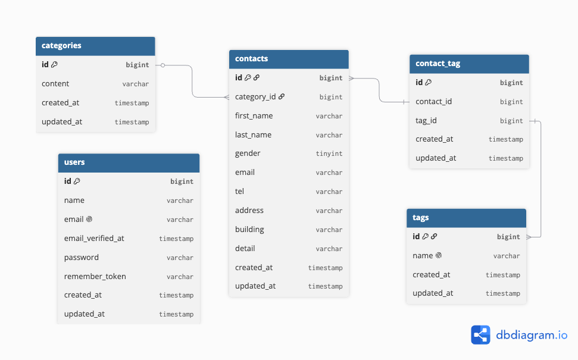

# Contact Form App

お問い合わせフォームアプリケーションです。

## 概要

本アプリケーションは、お問い合わせの送信・管理を行うWebアプリケーションです。

### 主な機能

#### Webアプリケーション

- お問い合わせ登録
- 入力内容確認
- サンクス画面
- 管理画面
- お問い合わせ検索
- お問い合わせ詳細（モーダル表示）
- お問い合わせ削除
- CSVエクスポート
- ログイン・ログアウト

#### API

- お問い合わせ一覧取得
- お問い合わせ詳細取得
- お問い合わせ作成
- お問い合わせ更新
- お問い合わせ削除

---

## ER図



### ER図補足

`contact_tag` テーブルには複合ユニーク制約を設定しています。

```sql
UNIQUE(contact_id, tag_id)
```

同じお問い合わせに同じタグが重複して登録されることを防ぐためです。

---

## 環境構築

### リポジトリをクローン

```bash
git clone https://github.com/sayaka1438/contact-form-app.git
```

### プロジェクトへ移動

```bash
cd contact-form-app
```

### Composerパッケージをインストール

```bash
composer install
```

### 環境変数ファイルを作成

```bash
cp .env.example .env
```

### Dockerコンテナを起動

```bash
./vendor/bin/sail up -d
```

### アプリケーションキーを生成

```bash
./vendor/bin/sail artisan key:generate
```

### データベースのマイグレーション・シーディング

```bash
./vendor/bin/sail artisan migrate --seed
```

### フロントエンド

```bash
./vendor/bin/sail npm install
```

```bash
./vendor/bin/sail npm run dev
```

---

## 使用技術

- PHP 8.5.7
- Laravel 10.50.2
- MySQL 8.0
- Nginx
- Node.js 24.16.0
- Docker
- Laravel Sail
- PHPUnit
- Laravel Pint

---

## APIエンドポイント一覧

| Method | URI                        | 概要                 |
| ------ | -------------------------- | -------------------- |
| GET    | /api/v1/contacts           | お問い合わせ一覧取得 |
| GET    | /api/v1/contacts/{contact} | お問い合わせ詳細取得 |
| POST   | /api/v1/contacts           | お問い合わせ作成     |
| PUT    | /api/v1/contacts/{contact} | お問い合わせ更新     |
| DELETE | /api/v1/contacts/{contact} | お問い合わせ削除     |

---

## 開発環境

| 内容       | URL                   |
| ---------- | --------------------- |
| Web        | http://localhost      |
| Vite       | http://localhost:5173 |
| phpMyAdmin | http://localhost:8080 |

---

## テスト

### 実施内容

- Feature Test
- Unit Test

### 実行コマンド

```bash
./vendor/bin/sail test
```

```bash
./vendor/bin/sail artisan test --coverage
```

### 結果

- 全テスト成功
- テストカバレッジ：77.0%

---

## 工夫した点

- Feature Test・Unit Testを実装
- API Resourceを使用してレスポンス形式を統一
- APIのバリデーションメッセージを日本語化
- CSVエクスポート機能を実装
- GitHub Flowを用いて開発

---

## 補足

Factoryで日本語のダミーデータを生成するため、`config/app.php` の `faker_locale` を変更しています。

```php
'faker_locale' => 'ja_JP',
```

---

## GitHub Flowで開発

### 開発フロー

1. Issueを作成
2. featureブランチを作成
3. 実装
4. テスト
5. Pull Request作成
6. レビュー後にmainへマージ

### ブランチ例

- feature/contact-form
- feature/admin
- feature/csv-export
- feature/api
- feature/api-test
- docs/readme

---

## 作成者

sayaka
